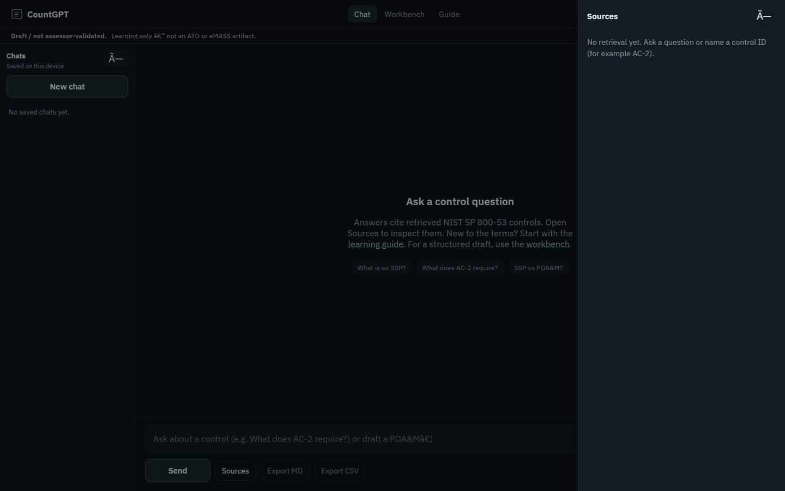

# CountGPT

A local app for learning NIST controls and practicing cybersecurity compliance work.

I built CountGPT to get more hands-on practice with the ISSO side of cybersecurity: understanding controls, working through findings, and writing the documents that go with them. I wanted a place to ask questions and try things out while learning.

I used AI to help write the code. My focus has been on what the app should do, how the compliance workflows fit together, and testing the results.

## What it does

CountGPT has three pages:

- **Chat:** Ask questions about NIST SP 800-53 controls and compliance concepts. The app searches the NIST catalog and shows the controls it retrieved alongside the answer.
- **Guide:** Read explanations of common terms, roles, and documents. A fictional system called MissionTracker walks through how they fit together.
- **Workbench:** Practice writing a Plan of Action and Milestones (POA&M) entry or a System Security Plan (SSP) implementation statement. You can start with a practice scenario or paste/upload finding data.

Chat history stays in your browser. Answers and drafts can be exported as Markdown or CSV.

This is a learning project. The generated text still needs review, and a draft from CountGPT is not an approved compliance document.

## See it in action



[Walkthrough video](docs/demo/countgpt-demo.mp4) · [More screenshots](docs/demo/)

## How it works

When you ask a question, CountGPT searches a local copy of the NIST SP 800-53 Rev. 5 catalog. It checks for control IDs such as AC-2 and also searches by meaning.

The matching text goes to Llama 3.1 8B, running through Ollama, along with your question. The model writes an answer, and the app shows the retrieved sources so you can check them. This approach is called retrieval-augmented generation, or RAG.

There is also an optional fine-tuning workflow for drafting. It uses 300 instruction-and-response examples to train a LoRA adapter, a smaller set of learned changes applied to the base model. If a usable adapter and CUDA are available, drafts use that path. Otherwise, they use Ollama. Control lookups and explanations use Ollama.

The interface uses HTML, CSS, and JavaScript. The backend is Python with FastAPI.

For a plain-English explanation of **every file**, see the [project guide](docs/PROJECT_GUIDE.md).

## Run it locally

You need Python 3.10–3.12 and [Ollama](https://ollama.com). The first setup downloads the NIST catalog, an embedding model for search, and the Llama model. Allow time and several gigabytes of disk space for those downloads.

Clone the repo and enter its folder:

```bash
git clone https://github.com/Xboyko/CountGPT.git
cd CountGPT
```

Start Ollama, then download the language model:

```bash
ollama pull llama3.1:8b
```

**Windows PowerShell:**

```powershell
.\start.ps1
```

The Windows launcher prefers WSL (Windows Subsystem for Linux), which is how I have been running the project. It also has a native Windows fallback. Avoid sharing the same virtual environment between Windows and WSL.

**WSL, Linux, or macOS:**

```bash
./start.sh
```

The launcher creates or reuses a Python environment, prepares missing search data, and starts the app.

Open **[http://127.0.0.1:7860](http://127.0.0.1:7860)** in your browser. Stop the server with Ctrl+C.

### Docker alternative

With Docker and Docker Compose installed, run this from the repo folder:

```bash
docker compose up --build
```

This starts the app and Ollama together. The first run prepares the data and downloads the Llama model. Open the same address above once startup finishes.

## Check the setup

Run these from the repo folder with the project's Python environment activated:

```bash
python setup_data.py --check
python -m unittest discover -s tests
python evals/run_retrieval_eval.py --fixture
```

To evaluate search against your actual local NIST index:

```bash
python evals/run_retrieval_eval.py
```

That evaluation checks whether search finds the expected controls. It does not grade the model's answers. It reports a skip if the index is missing.

If something is not working, open [the health endpoint](http://127.0.0.1:7860/api/health) to check the search data, Ollama connection, and adapter status. More setup options are in the [project guide](docs/PROJECT_GUIDE.md#running-the-pieces-yourself).

## Optional: train the drafting adapter

Training needs an NVIDIA GPU, CUDA, and the extra training dependencies. You can use the app without doing this.

```bash
pip install -r requirements-finetune.txt
python scripts/validate_training_data.py
python finetune.py
```

Restart the app afterward to make the saved adapter available for drafting. If it cannot be used, drafting falls back to Ollama.

The training examples are a small practice dataset. Fine-tuning is an experiment here; it does not establish that a draft is correct.

## Current limits

- Answers and drafts can be wrong. Retrieved sources make them easier to check.
- Finding imports are best-effort parsing, not a full scanner integration.
- The app has no login or multi-user access controls. It is intended for local use.
